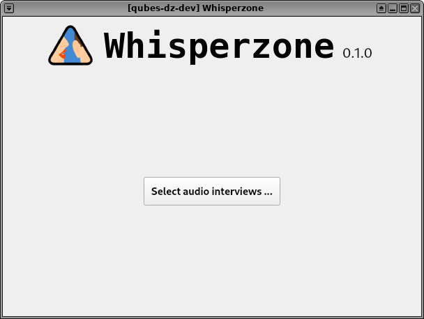
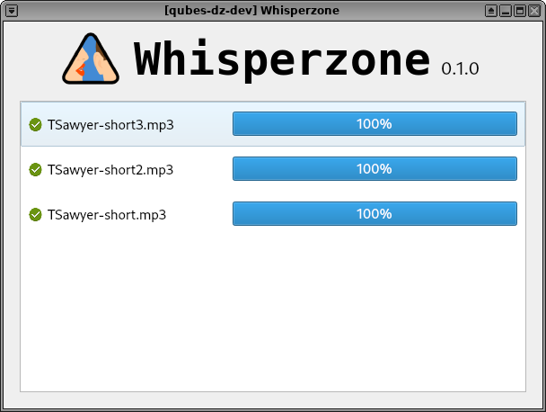

# Whisperzone

Transcribe automatically your audio interviews, without sending your recordings to the cloud.

|  | 
|--|--|

Whisperzone uses [OpenAI's Whisper](https://github.com/openai/whisper) software to transcribe interviews into a variety of formats with a high accuracy. The goal of this application is to provide a bare-bones graphical user interface for whisper so that non-technical people can easily take advantage of the transcription software.

## Getting started

- Download [Whisperzone 0.4.0 for Mac](TODO)
- Download [Whisperzone 0.4.0 for Windows](TODO)
- See [installing Whisperzone](INSTALL.md) for Linux repositories

You can also install Whisperzone for Mac using [Homebrew](https://brew.sh/): `brew install --cask whisperzone`

## About

Whisperzone was built on top of Dangerzone in a morning-long hackathon. The goal was to get a proof of concept of a graphical user interface that would already help tremendously journalists and others who have to transcribe sensitive interviews.

While more sophisticated user interfaces around OpenAI's Whisper are still in development (e.g. [Stage Whisper](https://github.com/Stage-Whisper/Stage-Whisper)), whisperzone tries to bring immediately to non-technical the power of whisper.

Set up a development environment by following [these instructions](/BUILD.md).
